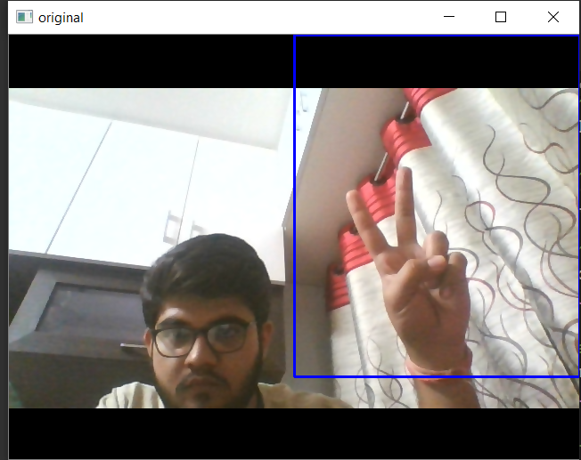
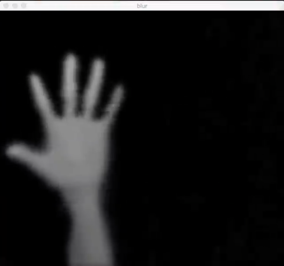
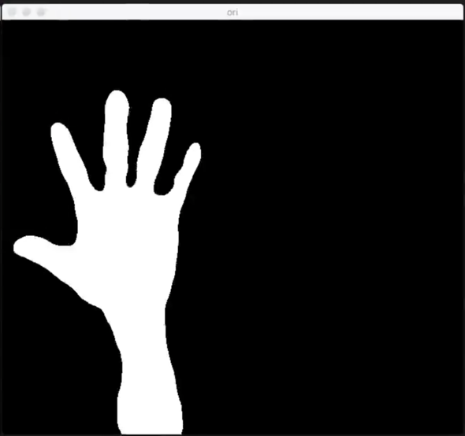
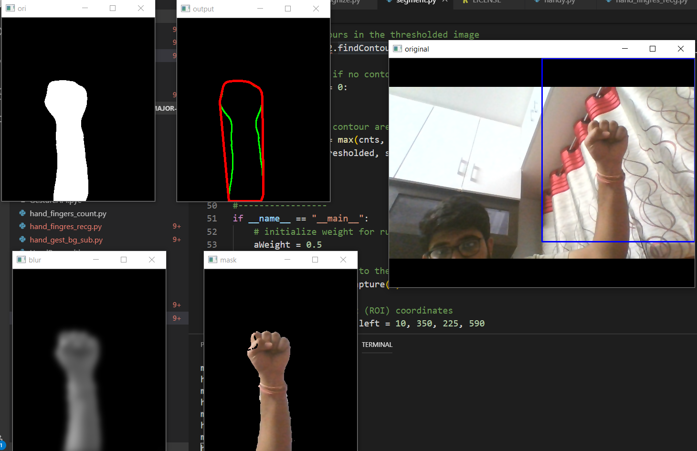
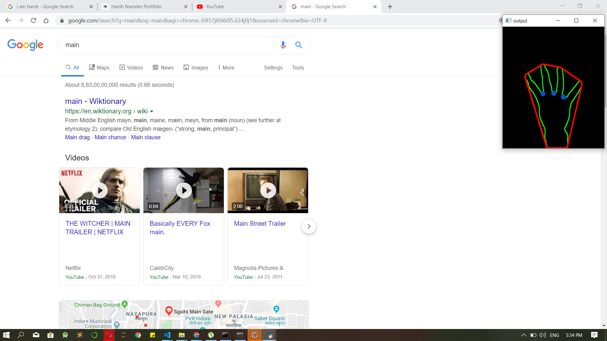

# Hand-Gesture-To-Control-PC
This is project based on opencv and python by which we can control our pc by using our hand and webcam 

# Environment
- OS: Windows 
- Platform: Python 3
- Librarys: 
	- OpenCV 3
	- appscript

# Requirements
- import cv2
- import numpy as np
- import copy
- import math
- import pyautogui
- import time

 ## How to run it?
- run it in python 
- command : python hand-gesture.py  (For hand recognition)
- press `'b'` to capture the background model (Remember to move your hand out of the blue rectangle)
- press `'r'` to reset the backgroud model
- press `'ESC'` to exit

## Process
#### Capture original image

Capture video from camera and pick up a frame.



#### Capture background model & Background subtraction
Use background subtraction method called **Gaussian Mixture-based Background/Foreground Segmentation Algorithm** to subtract background. 

Here I use the OpenCV's built-in function `BackgroundSubtractorMOG2` to subtract background.

```python
bgModel = cv2.BackgroundSubtractorMOG2(0, bgSubThreshold)
```

Build a background subtractor model


```python
fgmask = bgModel.apply(frame)
```
Apply the model to a frame


```python
res = cv2.bitwise_and(frame, frame, mask=fgmask)
```

Get the foreground(hand) image


#### Gaussian blur & Threshold
```python
gray = cv2.cvtColor(img, cv2.COLOR_BGR2GRAY)
```
First convert the image to gray scale.

```python
blur = cv2.GaussianBlur(gray, (blurValue, blurValue), 0)
```
By Gaussian blurring, we create smooth transition from one color to another and reduce the edge content.



```python
ret, thresh = cv2.threshold(blur, threshold, 255, cv2.THRESH_BINARY)
```
We use thresholding to create binary images from grayscale images. 




#### Contour & Hull & Convexity 
We now need to find out the hand contour from the binary image we created before and detect fingers (or in other words, recognize gestures)

```python
contours, hierarchy = cv2.findContours(thresh1, cv2.RETR_TREE, cv2.CHAIN_APPROX_SIMPLE)
```
This function will find all the contours from the binary image. We need to get the biggest contours (our hand) based on their area since we can assume that our hand will be the biggest contour in this situation. (it's obvious)

After picking up our hand, we can create its hull and detect the defects by calling :
```python
hull = cv2.convexHull(res)
defects = cv2.convexityDefects(res, hull)
```




#### Using on Chrome 


#### Gesture to Operate 
- 1.Switch right
- 2.Switch left
- 3.Scroll down
- 4.Scroll up
- 5.Maximize
- 0.Minimize

## References & Tutorials

1. OpenCV documentation: 
http://docs.opencv.org/2.4.13/
